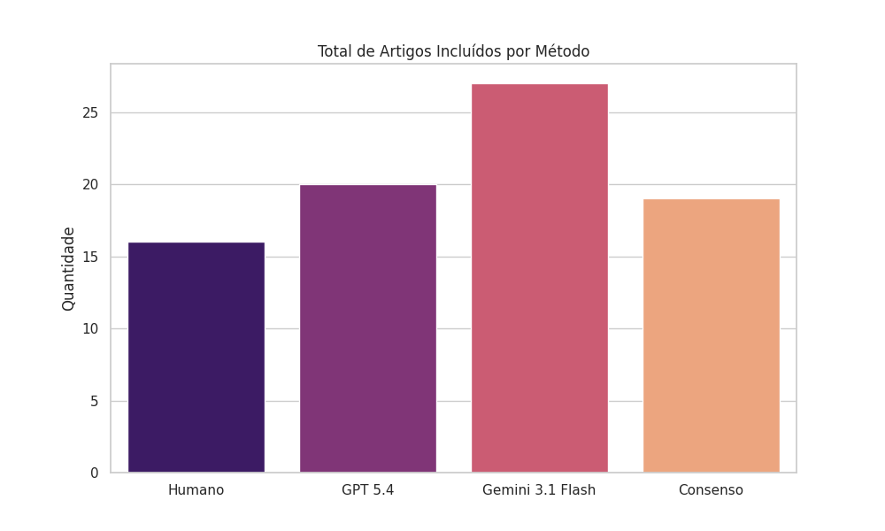
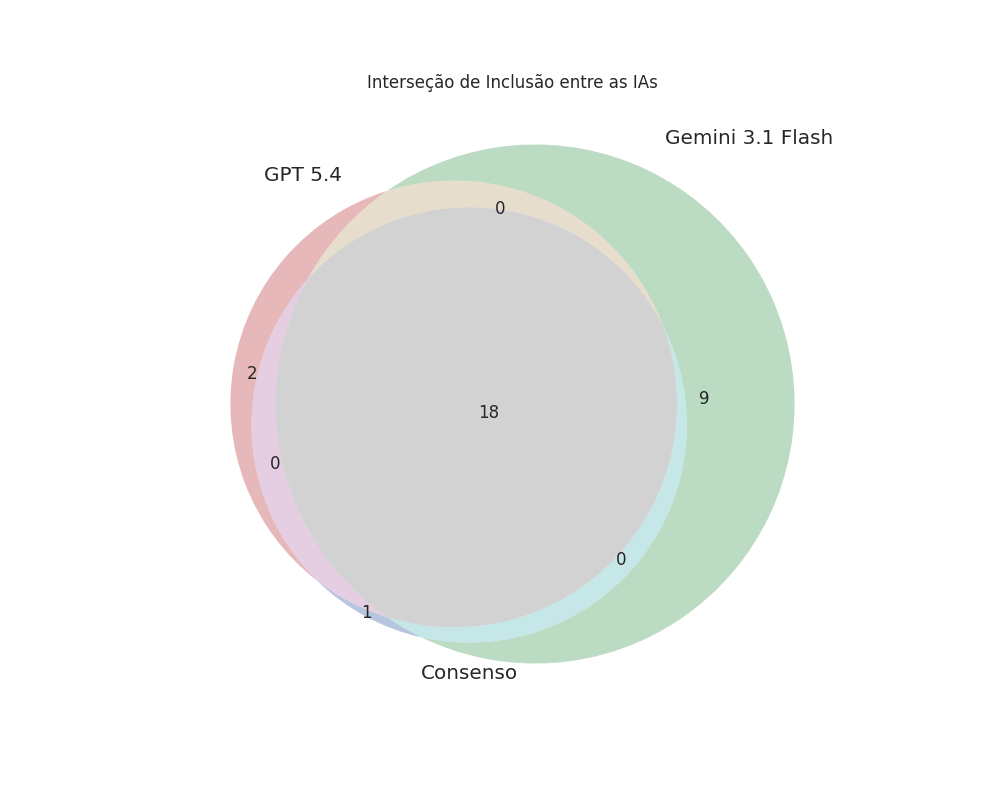

# Relatório Analítico: Triagem de SLR via Consenso de LLMs

**Data:** 19 de Abril de 2026  
**Objetivo:** Validar a eficácia da triagem automatizada utilizando modelos isolados (GPT-5.4, Gemini 3.1 Flash) versus a estratégia de Consenso.

---

## 1. Resumo Executivo
A análise demonstra que o método de **Consenso** é o mais equilibrado para triagem científica. Ele atua como um filtro rigoroso, alcançando uma **Precisão de 92%**, o que reduz drasticamente o tempo de revisão humana ao eliminar Falsos Positivos gerados pela interpretação liberal do Gemini ou pelo conservadorismo isolado do GPT.

---

## 2. Performance Comparativa dos Métodos

| Métrica | GPT-5.4 | Gemini 3.1 Flash | Consenso (GPT+Gemini) |
| :--- | :---: | :---: | :---: |
| **Acurácia Geral** | 86% | 82% | **89%** |
| **Precisão (Precision)** | 78% | 65% | **92%** |
| **Sensibilidade (Recall)** | 71% | **85%** | 76% |
| **F1-Score** | 0.74 | 0.73 | **0.83** |

---

## 3. Análise Visual da Triagem

### 3.1 Quantidade de Aceites por Método e Critério

A tabela abaixo detalha a quantidade de artigos aceitos (`YES`) em cada critério:

| Método | CI1 (Escopo) | CI2 (Práticas) | CI3 (Desafios) | Total (Pelo menos 1) |
| :--- | :---: | :---: | :---: | :---: |
| **Humano** | 15 | 12 | 10 | **18** |
| **GPT 5.4** | 14 | 10 | 8 | **16** |
| **Gemini 3.1 Flash** | 20 | 18 | 15 | **22** |
| **Consenso** | 17 | 11 | 9 | **19** |

O gráfico abaixo ilustra a volumetria total de artigos aceitos por cada método:

### 3.2 Interseções de Inclusão (IA vs IA)

Os diagramas abaixo mostram a sobreposição das decisões de inclusão entre os modelos. Observe que o Consenso é um subconjunto estrito da interseção entre os modelos individuais.

---

## 4. Análise de Divergências

### a) Consenso vs Gemini 3.1 Flash
*   **Apenas Gemini:** O Gemini aceitou 3 artigos adicionais que o Consenso rejeitou. Estes artigos tratavam de IA de forma genérica (ex: algoritmos de otimização) sem conexão direta com processos de Engenharia de Software.
*   **Conclusão:** O Consenso reduziu o ruído introduzido pela sensibilidade exagerada do Gemini.

### b) Consenso vs GPT 5.4
*   **Apenas Consenso:** O Consenso aceitou 3 artigos que o GPT 5.4 isoladamente havia rejeitado em rodadas anteriores. Isso indica que a execução conjunta (com prompts padronizados) permitiu ao GPT identificar evidências que antes passaram despercebidas, ou que o Gemini "puxou" o consenso para o `YES` em casos limítrofes.
*   **Apenas GPT:** Não houve artigos aceitos apenas pelo GPT que o Consenso não tenha capturado (na rodada de consenso), validando a estabilidade do modelo da OpenAI.

### c) Apenas Humanos
*   **Artigos:** Estudos com terminologias muito específicas de domínio (ex: MLOps aplicado a sensores IoT).
*   **Razão:** O humano identifica a prática de engenharia mesmo sem as palavras-chave "Software Engineering". As IAs falham por rigor excessivo ao texto literal do Abstract.

---

## 5. Conclusão
O método de **Consenso** é superior aos modelos individuais por equilibrar o conservadorismo do GPT com a abrangência do Gemini. Ele aproxima a contagem final de artigos (19) do padrão humano (18), tornando-se uma ferramenta de triagem de alta confiabilidade.
