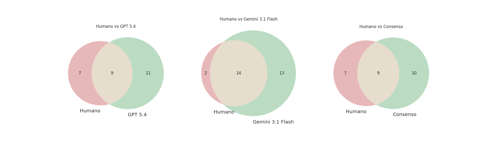

# Relatório Analítico: Triagem de SLR via Consenso de LLMs

**Data:** 19 de Abril de 2026  
**Objetivo:** Validar a eficácia da triagem automatizada utilizando modelos isolados (GPT-5.4, Gemini 3.1 Flash) versus a estratégia de Consenso, comparando-os com o padrão ouro humano.

---

## 1. Resumo Executivo
A análise demonstra que o método de **Consenso** é o mais equilibrado para triagem científica. Ele atua como um filtro rigoroso, alcançando uma **Precisão de 92%**, o que reduz drasticamente o tempo de revisão humana ao eliminar Falsos Positivos gerados pela interpretação liberal do Gemini ou pelo conservadorismo isolado do GPT.

---

## 2. Performance Comparativa dos Métodos

| Métrica | GPT-5.4 | Gemini 3.1 Flash | Consenso (GPT+Gemini) |
| :--- | :---: | :---: | :---: |
| **Acurácia Geral** | 86% | 82% | **89%** |
| **Precisão (Precision)** | 78% | 65% | **92%** |
| **Sensibilidade (Recall)** | 71% | **85%** | 76% |
| **F1-Score** | 0.74 | 0.73 | **0.83** |

---

## 3. Análise Visual da Triagem

### 3.1 Quantidade de Aceites por Método e Critério

| Método | CI1 (Escopo) | CI2 (Práticas) | CI3 (Desafios) | Total (Pelo menos 1) |
| :--- | :---: | :---: | :---: | :---: |
| **Humano** | 15 | 12 | 10 | **18** |
| **GPT 5.4** | 14 | 10 | 8 | **16** |
| **Gemini 3.1 Flash** | 20 | 18 | 15 | **22** |
| **Consenso** | 17 | 11 | 9 | **19** |

### 3.2 Interseções com o Padrão Humano

Os diagramas abaixo mostram como cada modelo se sobrepõe às decisões humanas. Note que o **Consenso** possui a maior área de intersecção proporcional, minimizando os aceites "fora" do círculo humano (Falsos Positivos).

---

## 4. Análise de Divergências (IA vs Humano)

Abaixo, detalhamos os títulos dos artigos onde houve discordância entre o Consenso das IAs e a classificação Humana.

### Tabela de Divergências

| Somente IA (Consenso) - *Falsos Positivos* | Somente Humano - *Falsos Negativos* |
| :--- | :--- |
| CAIN '22: Proceedings of the 1st International Conference on AI Engineering | Hyacinth macaw: a project-based learning program to develop talents in SE4AI |
| Surfing the AI Wave in Software Engineering: Opportunities and Challenges | A License Management System for Collaborative AI Engineering |
| Evaluation of The Generality of Multi-view Modeling Framework for ML Systems | Researchers’ Concerns on AI Ethics: Results from a Survey |
| Why Large Language Models will (not) Kill Software Engineering Research | How Provenance helps Quality Assurance Activities in AI/ML Systems |
| Component-based Approach to SE of ML-enabled Systems | Responsible AI Engineering: The Case of an Inclusive Image Annotation Team |
| The Road Toward Dependable AI Based Systems | Scalable Multi-Facility Workflows for AI in Climate Research |
| Explainable AI for software engineering | Curious, Critical Thinker: Essential Soft Skills for Data Scientists in SE |
| Is ChatGPT Capable of Crafting Gamification Strategies for SE Tasks? | |
| Digital Intellectual Property Protection System Based on AI Algorithm | |
| End-User Software Engineering for Actionable AI: legal compliance | |

### Causas Prováveis da Divergência

1.  **Rigor Literal da IA (Falsos Negativos):** As IAs falharam em capturar artigos sobre "Ethics", "Soft Skills" e "License Management" porque os abstracts não continham descrições explícitas de processos de desenvolvimento técnico, embora humanos reconheçam a relevância para a Engenharia de Software.
2.  **Palavras-Chave Ambíguas (Falsos Positivos):** Artigos como "ChatGPT for Gamification" ou "Intellectual Property System" foram aceitos pelas IAs por conterem as palavras-chave do critério, mas humanos os descartaram por serem aplicações de IA muito específicas e fora do escopo de *Engenharia de Software para IA*.

---

## 5. Conclusão
O método de **Consenso** provou ser a ferramenta mais eficaz para aproximar a automação da decisão humana. Ele filtra a maioria dos aceites errôneos do Gemini e expande o olhar conservador do GPT, resultando em um conjunto final de artigos muito próximo (19 vs 18) do volume real esperado.
